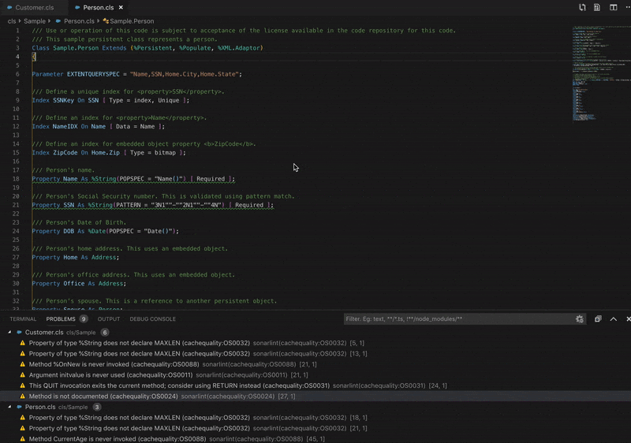

# objectscriptQuality for Visual Studio Code

objectscriptQuality for VSCode is an IDE extension that helps you detect and fix quality issues as you write code. Like a spell checker,  this plugin  squiggles flaws so they can be fixed before committing code. You can get it directly from the VS Code Marketplace and it will then detect new bugs and quality issues as you code (ObjectScript and JavaScript)

## How it works

Simply open a INT, MAC, CLS or JS file, start coding, and you will start seeing issues reported by objectscriptQuality. Issues are highlighted in your code, and also listed in the 'Problems' panel.

You can access the detailed rule description directly from your editor, using the provided contextual menu.

## Rules

Check the rules to see what objectscriptQuality can do for you:

- [ObjectScript rules](https://www.objectscriptQuality.com/docs/objectscriptquality-release/rules)
- [JavaScript rules](https://rules.sonarsource.com/javascript)

You will benefit from the following code analyzers: [objectscriptQuality](https://www.objectscriptQuality.com) and [SonarJS](https://redirect.sonarsource.com/plugins/javascript.html)

## Requirements

The only thing you need is a Java Runtime (JRE) 8 installed on your computer.

objectscriptQuality should automatically find it but you can also explicitly set the path where the JRE is installed using the 'sonarlint.ls.javaHome' variable in VS Code settings. For example:

    {
        "sonarlint.ls.javaHome": "C:\Program Files\Java\jre1.8.0_131"
    }

### Connected mode

You can connect objectscriptQuality to SonarQube >= 5.6 or SonarCloud to benefit from the same rules and settings that are used to inspect your project on the server. objectscriptQuality then hides in VSCode the issues that are marked as **Won’t Fix** or **False Positive**.

To configure the connection, have a look at objectscriptQuality in default user settings.

If you change something on the server such as the quality profile, you can trigger an update of the local cache using the "Update SonarLint binding to SonarQube/SonarCloud" command on the command palette (search for "sonarlint").

For security reasons, the token should not be stored in SCM with workspace settings.

## Contributions and license

objectscriptQuality for VSCode is a software distributed under freeware basis. This software is composed of the objectscriptQuality plugin and a modified version of SonarLint.

SonarLint is a trademark of SonarSource S.A., and is free software; you can redistribute it and/or modify it under the terms of the GNU Lesser General Public License as published by the Free Software Foundation; either version 3 of the License, or (at your option) any later version. See the GNU Lesser General Public License for more details.

CachéQuality for VSCode is distributed in the hope that it will be useful, but WITHOUT ANY WARRANTY; without even the implied warranty of MERCHANTABILITY or FITNESS FOR A PARTICULAR PURPOSE.

## Feedback

The preferred way to discuss about objectscriptQuality for VSCode is by posting on the [Project Issues tab](https://github.com/litesolutions/objectscriptquality-vscode/issues). Feel free to ask questions, report issues, and give suggestions.
